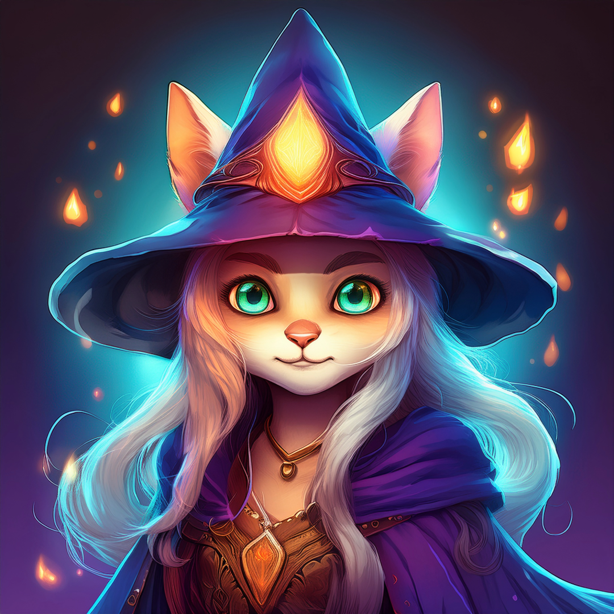

# Meowgic Kingdom



Welcome to **Meowgic Kingdom** — a 2D turn-based RPG where kittens harness ancient arcane powers, scale to god-tier strength, and face off against the tyrannical **Lion King** who rules the land with fire and fluff.

This is a solo indie dev project being built in Godot 4 with ❤️, claws, and a borderline unhealthy amount of coffee. The goal? A modular, expandable RPG experience with tactical combat, dungeon-crawling, and way too many puns.

---

## 🎮 Current Features

- 🐱 Play as the Meowgic Cat, an orphan turned arcane prodigy
- 📸 Smooth 2.5D camera with z-index scaling for immersive depth

---

## 🔮 In the Works

- 🧱 Modular dungeon system
- 🧙 Turn-based combat system
- 🧠 WIP character system with growth, scaling stats, and combat triggers
- 🏰 A fleshed-out overworld (camp, shop, shrine)
- 🐾 Enemy classes with unique magic/behavior
- 🔥 Boss battle: The Fire-Lord Lion King himself
- 💬 Dialogue system (sassy cat banter included)
- 🎨 Art style based on Chaykov’s Tokyo with hand-painted, outlined backgrounds

---

## 📁 Project Structure

```
meowgic-kingdom/  
├── assets/ # Sprites, backgrounds, textures  
├── scenes/ # .tscn scene files  
├── scripts/ # Game logic & GDScript  
├── builds/ # Exported executables  
└── README.md
```

---

## 🛠 Tech Stack

- [Godot Engine 4.x](https://godotengine.org/)
- Blender (for modeling & UV-mapped textures)
- Photoshop (for hand-drawn assets)
- Stable Diffusion (used for concepting only)
- GDScript

---

## 🚧 Disclaimer

This project is still in its **clawing-its-way-to-existence phase**. Mechanics and assets are subject to change, break, or spontaneously combust.

If you're here to follow development, offer support, or just vibe with cats doing magic — you're in the right place.

---

## 🐱 Stay in the Loop

Meowgic Kingdom will eventually have:
- Devlogs
- A playable demo
- Maybe a cursed Kickstarter, who knows

Until then, you can:
- ⭐ Star this repo to follow progress
- 📬 Contact me if you want to collaborate, test, or just send cat memes

---

## 🐾 Credits

Made by [NILBOGtheSavior](https://github.com/NILBOGtheSavior)  
Art, code, and design by one determined goblin with big dreams and even bigger to-do lists.

---

> “Even the smallest kitten may one day cast the biggest fireball.” – Ancient Cat Proverb
